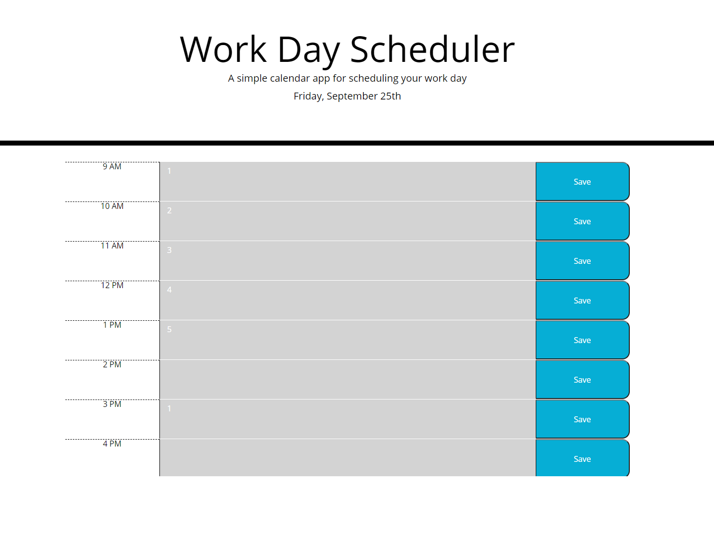

# Work-Day-Scheduler

## Description
For this project, the goal was to create a day planner utilizing the momentJS API to collect information about the current time and date. I began by collecting the date formatted from momentJS as "day of the week, Month, Date as a number", and posting it to the text content of the div ID currentDay. I then created a function that sets a variable to the current hour in a 24 hour format, and had that function call at an interval of a second, to constantly update the time. Using that function, I was able to set the color of each text input field based on the current hour utilizing if statements in a for loop to compare the current time to the id of the column. The current hour shows as red, past hours show as a lighter red, and future hours show as green. After that, I created a function to save user input in the text field to local storage. Each button was created with a numerical value 0-8, in order to use the button's value as an index for the array of textareas. For example, when a user presses the save button for the 9 AM column which has a value of 0, the text field with the index of 0's value is stored to a variable, which is then pushed to local storage. When the page is loaded for the first time, a function is called with a for loop to push all items in local storage to the array "container", and then set the value of all text areas with index i to whatever is in the container at index i. These functions allow the page to be updated with user saved input, for the user to be able to save new input, and for the text input area's color to be updated every hour.
 

## Table of Contents

* [Installation](#installation)
* [Usage](#usage)
* [Built With](#built_with)
* [Deployed Link](#deployed_link)
* [Author](#author)
* [Images](#images)
* [License](#license)

## Installation
To launch this site, I created a repository on github and utilized github pages to host it.

## Usage
This application was designed to be able to store information a user wants to remember for each hour of the work day. Upon clicking the save button, the field of text will be saved to local-storage. When loading the page for the first time, or refreshing - the text that the user chose to save will display in the given text field. 

## Built_With
* JavaScript
* MomentJS
* HTML
* Bootstrap
* CSS
* [Github](https://github.com/)

## Deployed_Link
[Work Day Scheduler](https://jsp117.github.io/Work-Day-Scheduler/)

## Author
Jonathan SanPedro - Bachelors of Information Technology Rutgers New Brunswick - Student at Berkeley Coding Bootcamp

* [Github](https://github.com/jsp117)
* [LinkedIn](https://www.linkedin.com/in/jonathan-s-6ab32283/)

## Images

## License

MIT License

Copyright (c) [2020] [Jonathan J. SanPedro]

Permission is hereby granted, free of charge, to any person obtaining a copy
of this software and associated documentation files (the "Software"), to deal
in the Software without restriction, including without limitation the rights
to use, copy, modify, merge, publish, distribute, sublicense, and/or sell
copies of the Software, and to permit persons to whom the Software is
furnished to do so, subject to the following conditions:

The above copyright notice and this permission notice shall be included in all
copies or substantial portions of the Software.

THE SOFTWARE IS PROVIDED "AS IS", WITHOUT WARRANTY OF ANY KIND, EXPRESS OR
IMPLIED, INCLUDING BUT NOT LIMITED TO THE WARRANTIES OF MERCHANTABILITY,
FITNESS FOR A PARTICULAR PURPOSE AND NONINFRINGEMENT. IN NO EVENT SHALL THE
AUTHORS OR COPYRIGHT HOLDERS BE LIABLE FOR ANY CLAIM, DAMAGES OR OTHER
LIABILITY, WHETHER IN AN ACTION OF CONTRACT, TORT OR OTHERWISE, ARISING FROM,
OUT OF OR IN CONNECTION WITH THE SOFTWARE OR THE USE OR OTHER DEALINGS IN THE
SOFTWARE.

